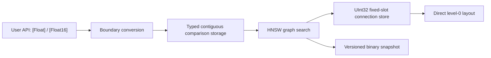

# Pure Swift Optimization Roadmap

## Goal

SwiftHNSW should prove whether the Pure Swift backend can replace the C++ backend for production workloads. The C++ backend remains an explicit native accelerator until the Pure Swift backend reaches measured parity on the target workloads.

## Design Contract

| Area | Contract |
| --- | --- |
| Public API | Keep `HNSWIndex<Float>` and `HNSWIndex<Float16>` as the stable user-facing types. |
| WASM | The Pure Swift backend must build with the Swift WebAssembly SDK. |
| Runtime vectors | Store comparison vectors in type-specific contiguous arenas: `[Float]` for Float32 and `[Float16]` for Float16. |
| Graph connections | Store graph connections in a dedicated fixed-slot connection store, with `UInt32` internal IDs and a direct level-0 layout. |
| Persistence | Preserve the versioned serialized graph format unless a migration is explicitly introduced. |
| C++ backend | Keep it optional until benchmark evidence shows the Pure Swift backend is consistently sufficient. |

## Milestones

| Milestone | Scope | Exit Criteria | Status |
| --- | --- | --- | --- |
| M0 Baseline | Keep a repeatable Pure Swift vs C++ benchmark suite. | Build/search latency and recall are recorded for Float32 and Float16. | In progress |
| M1 Hot Path Cleanup | Remove closure heaps, use pointer distance kernels, and keep lower-bound state in the search loop. | Pure Swift tests, C++ trait tests, and WASM build pass. | Done |
| M2 Graph Storage | Replace nested graph arrays with a dedicated connection store. | No runtime `[[[Int]]]` graph storage remains in the Pure Swift backend. | Done |
| M2.5 Internal ID and Level-0 Layout | Use `UInt32` internal IDs, direct level-0 neighbor offsets, and separate upper-level storage. | Level-0 reads do not require upper-slot lookup; overflow is rejected at initialization. | Done |
| M2.6 Float16 Arena | Store Float16 indexes in `[Float16]` and use Float16 SIMD distance kernels. | Float16 debug diagnostics show zero Float arena usage; serialization roundtrip still passes. | Done |
| M3 Snapshot Layout | Align persisted snapshots with runtime storage without breaking existing loads. | Existing graph snapshots still load; new snapshots remain versioned. | In progress |
| M4 Database Integration | Ensure database-framework stores vector payloads as binary and feeds SwiftHNSW without tuple expansion. | Flat, HNSW, IVF, and PQ vector payloads use Float32 little-endian bytes. | In progress |
| M5 Parity Decision | Compare Pure Swift and C++ across target workloads. | Pure Swift is within the accepted performance envelope, or C++ remains optional. | Pending |
| M6 Release Gate | Run full tests and publish benchmark report. | Swift tests, C++ tests, WASM build, and dependent package tests pass. | Pending |

## Performance Decision Rule

Pure Swift can make the C++ backend unnecessary only if it is consistently close to the C++ backend on production workloads:

| Metric | Target |
| --- | --- |
| Search p50 / p95 | Within 1.2x of C++ for target dimensions and corpus sizes. |
| Build time | Within 1.2x of C++ or justified by better portability. |
| Recall | No regression against the current graph algorithm at the same parameters. |
| WASM | Pure Swift remains the default portable backend. |

If these conditions are not met, the C++ backend should stay as an optional native acceleration path.

## Current Implementation Notes

- The Pure Swift backend stores Float32 comparison vectors in `comparisonStorage: [Float]`.
- The Pure Swift backend stores Float16 comparison vectors in `halfComparisonStorage: [Float16]`.
- Float16 distance kernels convert SIMD lanes to Float for accumulation without expanding the stored vector arena.
- Candidate queues use specialized heap types instead of closure-based generic heaps.
- Graph connections are stored in `HNSWConnectionStore`, which uses `UInt32` internal IDs, direct level-0 slots, and compact upper-level slots.
- Search traversal reads neighbor storage ranges directly to avoid per-neighbor slot lookup and optional branching.
- Search uses a bare path when there are no deleted entries and caches the layer lower bound locally instead of repeatedly reading heap top state.
- Query search returns the requested top-k without sorting the full `efSearch` candidate set.
- Serialization still writes the existing graph format for compatibility.

## Latest Local Benchmark Snapshot

Environment: local Apple Silicon debug workspace, release test build, Swift 6.3.1. These are single-run measurements; repeated runs are required before making a backend removal decision.

| Case | Backend | Build Seconds | efSearch | Latency ms/query | Recall@10 |
| --- | --- | ---: | ---: | ---: | ---: |
| Float32 10k x 128 | Pure Swift | 1.356502 | 100 | 0.072916 | 0.829600 |
| Float32 10k x 128 | C++ hnswlib | 1.248331 | 100 | 0.061132 | 0.831600 |
| Float32 10k x 128 | Pure Swift | 1.356502 | 320 | 0.209610 | 0.980800 |
| Float32 10k x 128 | C++ hnswlib | 1.248331 | 320 | 0.172348 | 0.981000 |
| Float32 50k x 128 | Pure Swift | 10.614944 | 100 | 0.105860 | 0.545000 |
| Float32 50k x 128 | C++ hnswlib | 11.492041 | 100 | 0.131210 | 0.547000 |
| Float32 50k x 128 | Pure Swift | 10.614944 | 320 | 0.316440 | 0.840000 |
| Float32 50k x 128 | C++ hnswlib | 11.492041 | 320 | 0.392160 | 0.839000 |
| Float32 50k x 128 | Pure Swift | 10.614944 | 1000 | 0.929050 | 0.963500 |
| Float32 50k x 128 | C++ hnswlib | 11.492041 | 1000 | 1.115020 | 0.968000 |
| Float16 10k x 128 | Pure Swift | 1.364497 | 100 | 0.068368 | 0.838600 |
| Float16 10k x 128 | C++ hnswlib | 1.265387 | 100 | 0.058880 | 0.836400 |
| Float16 10k x 128 | Pure Swift | 1.364497 | 320 | 0.191086 | 0.981200 |
| Float16 10k x 128 | C++ hnswlib | 1.265387 | 320 | 0.159216 | 0.980400 |

Interpretation:

- Pure Swift is close but not consistently within the parity target across all measured cases.
- C++ remains faster for 10k search in this single run.
- Pure Swift is faster in the measured 50k search cases and build time, but the sample is still a single run.
- Float16 now uses half storage in the Swift backend; repeated measurements are still required before a final parity decision.
- The C++ backend should remain optional until repeated benchmark runs and larger corpus sizes confirm the decision.
