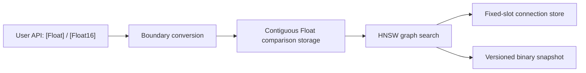

# Pure Swift Optimization Roadmap

## Goal

SwiftHNSW should prove whether the Pure Swift backend can replace the C++ backend for production workloads. The C++ backend remains an explicit native accelerator until the Pure Swift backend reaches measured parity on the target workloads.

## Design Contract

| Area | Contract |
| --- | --- |
| Public API | Keep `HNSWIndex<Float>` and `HNSWIndex<Float16>` as the stable user-facing types. |
| WASM | The Pure Swift backend must build with the Swift WebAssembly SDK. |
| Runtime vectors | Store comparison vectors in contiguous `Float` memory. Convert `Float16` at ingestion and query boundaries. |
| Graph connections | Store graph connections in a dedicated fixed-slot connection store, not nested `[[[Int]]]` arrays. |
| Persistence | Preserve the versioned serialized graph format unless a migration is explicitly introduced. |
| C++ backend | Keep it optional until benchmark evidence shows the Pure Swift backend is consistently sufficient. |

## Milestones

| Milestone | Scope | Exit Criteria | Status |
| --- | --- | --- | --- |
| M0 Baseline | Keep a repeatable Pure Swift vs C++ benchmark suite. | Build/search latency and recall are recorded for Float32 and Float16. | In progress |
| M1 Hot Path Cleanup | Remove closure heaps, use pointer distance kernels, and keep `Float16` comparisons in `Float`. | Pure Swift tests, C++ trait tests, and WASM build pass. | Done |
| M2 Graph Storage | Replace nested graph arrays with a dedicated connection store. | No runtime `[[[Int]]]` graph storage remains in the Pure Swift backend. | Done |
| M3 Snapshot Layout | Align persisted snapshots with runtime storage without breaking existing loads. | Existing graph snapshots still load; new snapshots remain versioned. | In progress |
| M4 Database Integration | Ensure database-framework stores vector payloads as binary and feeds SwiftHNSW without tuple expansion. | Flat, HNSW, IVF, and PQ vector payloads use Float32 little-endian bytes. | In progress |
| M5 Parity Decision | Compare Pure Swift and C++ across target workloads. | Pure Swift is within the accepted performance envelope, or C++ remains optional. | Pending |
| M6 Release Gate | Run full tests and publish benchmark report. | Swift tests, C++ tests, WASM build, and dependent package tests pass. | Pending |

## Performance Decision Rule

Pure Swift can make the C++ backend unnecessary only if it is consistently close to the C++ backend on production workloads:

| Metric | Target |
| --- | --- |
| Search p50 / p95 | Within 1.2x of C++ for target dimensions and corpus sizes. |
| Build time | Within 1.2x of C++ or justified by better portability. |
| Recall | No regression against the current graph algorithm at the same parameters. |
| WASM | Pure Swift remains the default portable backend. |

If these conditions are not met, the C++ backend should stay as an optional native acceleration path.

## Current Implementation Notes

- The Pure Swift backend stores comparison vectors in `comparisonStorage: [Float]`.
- `Float16` inputs are converted once at add/search boundaries and accumulated in `Float` precision.
- Candidate queues use specialized heap types instead of closure-based generic heaps.
- Graph connections are stored in `HNSWConnectionStore`, which uses fixed slots per node level and avoids nested neighbor arrays in the hot path.
- Search traversal reads neighbor storage ranges directly to avoid per-neighbor slot lookup and optional branching.
- Query search returns the requested top-k without sorting the full `efSearch` candidate set.
- Serialization still writes the existing graph format for compatibility.

## Latest Local Benchmark Snapshot

Environment: local Apple Silicon debug workspace, release test build, Swift 6.3.1. These are single-run measurements; repeated runs are required before making a backend removal decision.

| Case | Backend | Build Seconds | efSearch | Latency ms/query | Recall@10 |
| --- | --- | ---: | ---: | ---: | ---: |
| Float32 10k x 128 | Pure Swift | 1.506942 | 100 | 0.095728 | 0.829600 |
| Float32 10k x 128 | C++ hnswlib | 1.260181 | 100 | 0.064930 | 0.831600 |
| Float32 10k x 128 | Pure Swift | 1.506942 | 320 | 0.223552 | 0.980800 |
| Float32 10k x 128 | C++ hnswlib | 1.260181 | 320 | 0.163340 | 0.981000 |
| Float32 50k x 128 | Pure Swift | 13.071624 | 100 | 0.150910 | 0.545000 |
| Float32 50k x 128 | C++ hnswlib | 11.058015 | 100 | 0.220860 | 0.547000 |
| Float32 50k x 128 | Pure Swift | 13.071624 | 320 | 0.435925 | 0.840000 |
| Float32 50k x 128 | C++ hnswlib | 11.058015 | 320 | 0.738125 | 0.839000 |
| Float32 50k x 128 | Pure Swift | 13.071624 | 1000 | 1.290955 | 0.963500 |
| Float32 50k x 128 | C++ hnswlib | 11.058015 | 1000 | 2.499580 | 0.968000 |
| Float16 10k x 128 | Pure Swift | 1.515934 | 100 | 0.081404 | 0.838600 |
| Float16 10k x 128 | C++ hnswlib | 3.472194 | 100 | 0.134466 | 0.836400 |
| Float16 10k x 128 | Pure Swift | 1.515934 | 320 | 0.312448 | 0.981200 |
| Float16 10k x 128 | C++ hnswlib | 3.472194 | 320 | 0.364486 | 0.980400 |

Interpretation:

- Pure Swift is already competitive and faster in the measured 50k search cases.
- C++ remains faster for Float32 10k search and Float32 build time.
- Float16 search shows run-to-run variance; it needs repeated measurements before a final parity decision.
- The C++ backend should remain optional until repeated benchmark runs and larger corpus sizes confirm the decision.
