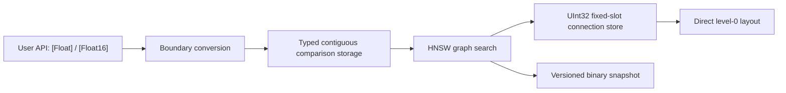

# HNSW Optimization Record

## Goal

SwiftHNSW uses one production index implemented in Swift. The hnswlib C++ implementation is retained only in a separate benchmark package as a performance and recall reference; it is not a product dependency or runtime backend.

## Design Contract

| Area | Contract |
| --- | --- |
| Public API | Keep `HNSWIndex<Float>` and `HNSWIndex<Float16>` as the stable user-facing types. |
| WASM | The production index must build with the Swift WebAssembly SDK. |
| Runtime vectors | Store comparison vectors in type-specific contiguous arenas: `[Float]` for Float32 and `[Float16]` for Float16. |
| Graph connections | Store graph connections in a dedicated fixed-slot connection store, with `UInt32` internal IDs and a direct level-0 layout. |
| Persistence | Preserve the versioned serialized graph format unless a migration is explicitly introduced. |
| Foundation boundary | Expose file and `Data` archive APIs only when FoundationEssentials or Foundation is available; keep the in-memory index available to Foundation-free Embedded targets. |
| Reference benchmark | Keep hnswlib isolated in `Benchmarks/HNSWReferenceComparison`; it must not enter the root package graph. |


```mermaid
flowchart LR
    A["User API: [Float] / [Float16]"] --> B["Boundary conversion"]
    B --> C["Typed contiguous comparison storage"]
    C --> D["HNSW graph search"]
    D --> E["UInt32 fixed-slot connection store"]
    E --> F["Direct level-0 layout"]
    D --> G["Versioned binary snapshot"]
```

## Milestones

| Milestone | Scope | Exit Criteria | Status |
| --- | --- | --- | --- |
| M0 Baseline | Keep a repeatable production-index vs hnswlib reference benchmark suite. | Build/search latency, median search latency, p95 search latency, and recall are recorded for Float32 and Float16. | Done |
| M1 Hot Path Cleanup | Remove closure heaps, use pointer distance kernels, and keep lower-bound state in the search loop. | Production index tests, reference comparison tests, and WASM build pass. | Done |
| M2 Graph Storage | Replace nested graph arrays with a dedicated connection store. | No runtime `[[[Int]]]` graph storage remains in the production index. | Done |
| M2.5 Internal ID and Level-0 Layout | Use `UInt32` internal IDs, direct level-0 neighbor offsets, and separate upper-level storage. | Level-0 reads do not require upper-slot lookup; overflow is rejected at initialization. | Done |
| M2.6 Float16 Arena | Store Float16 indexes in `[Float16]` and use Float16 SIMD distance kernels. | Float16 debug diagnostics show zero Float arena usage; serialization roundtrip still passes. | Done |
| M2.7 Metric Dispatch | Select L2 vs inner-product distance strategy once per search/build path. | Distance hot loops do not switch on `DistanceMetric` per comparison. | Done |
| M2.8 Search Workspace | Reuse caller-scoped workspace buffers for candidate and nearest heaps without truncating graph exploration. | Candidate queue capacity is based on node count, nearest queue capacity is based on `ef`, and tests pass. | Done |
| M2.9 Caller-Owned Output | Provide a search API that writes into caller-owned result storage. | `search(_:k:into:)` is available on the production index and preserves ordering/count semantics. | Done |
| M3 Snapshot Layout | Align persisted snapshots with runtime storage without breaking existing loads. | Existing graph snapshots still load; new snapshots remain versioned. | In progress |
| M4 Database Integration | Ensure database-framework stores vector payloads as binary and feeds SwiftHNSW without tuple expansion. | Flat, HNSW, IVF, and PQ vector payloads use Float32 little-endian bytes. | In progress |
| M5 Parity Decision | Compare the production index and hnswlib across target workloads. | The production index is within the accepted performance envelope and hnswlib is removed from the product graph. | Done |
| M6 Release Gate | Run full tests and publish benchmark results. | Production tests, reference comparison tests, WASM build, and dependent package tests pass. | In progress |

## Performance Decision

The production index met the acceptance criteria against the hnswlib reference on the measured workloads:

| Metric | Target |
| --- | --- |
| Search p50 / p95 | Within 1.2x of hnswlib for target dimensions and corpus sizes. |
| Build time | Within 1.2x of hnswlib or justified by better portability. |
| Recall | No regression against the current graph algorithm at the same parameters. |
| WASM | The production index remains portable to WebAssembly. |

Measured search latency and build throughput were faster than the hnswlib reference while recall remained comparable. The Swift implementation is therefore the sole production index. hnswlib remains only as a regression comparison target under `Benchmarks/HNSWReferenceComparison`.

## Current Implementation Notes

- The production index stores Float32 comparison vectors in `comparisonStorage: [Float]`.
- The production index stores Float16 comparison vectors in `halfComparisonStorage: [Float16]`.
- Float16 distance kernels convert SIMD lanes to Float for accumulation without expanding the stored vector arena.
- Candidate queues use bounded heap views over reusable workspace buffers instead of per-search heap arrays.
- Search candidate queues are sized by node count rather than `ef`; only the nearest-result heap is bounded by `ef`.
- HNSW graph traversal uses metric-specific distance computers so the hot loop does not branch on `DistanceMetric` for every comparison.
- Graph connections are stored in `HNSWConnectionStore`, which uses `UInt32` internal IDs, direct level-0 slots, and compact upper-level slots.
- Search traversal reads neighbor storage ranges directly to avoid per-neighbor slot lookup and optional branching.
- Search uses a bare path when there are no deleted entries and caches the layer lower bound locally instead of repeatedly reading heap top state.
- Query search returns the requested top-k without sorting the full `efSearch` candidate set.
- Latency-sensitive callers can use `search(_:k:into:)` to reuse result buffers.
- Reference comparison benchmarks record median and p95 search latency across repeated search iterations.
- Serialization still writes the existing graph format for compatibility.

## Decision Benchmark Snapshot

The release measurements are recorded in the [README reference benchmark section](../README.md#reference-index-benchmarks). Across the documented Float32 and Float16 workloads, the production index was 3.5% to 9.7% faster in search and 3.8% to 4.6% faster in build throughput than the hnswlib reference, with comparable recall.

The comparison remains reproducible with:

```bash
REFERENCE_COMPARISON_ITERATIONS=3 swift run -c release --package-path Benchmarks/HNSWReferenceComparison HNSWReferenceComparison
```
