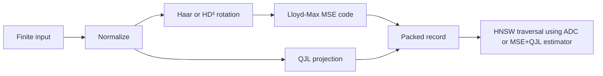

# TurboQuant Implementation and Benchmark Report

**Date:** 2026-07-31

**Toolchain:** `swift-6.4.x-DEVELOPMENT-SNAPSHOT-2026-07-23-a`

**Compiler commit:** `ef761e567dc94ee`

**Host:** Apple M4 Max, 14 CPU cores, 36 GB memory

**Workload:** deterministic synthetic unit vectors, cosine Recall@10, `M=16`,
`efConstruction=200`, seed `42`

## Outcome

The production `TurboQuantIndex` implements both TurboQuant objectives:

- MSE codes using Lloyd-Max scalar quantization and ADC.
- Product estimation using `(b - 1)` MSE bits, QJL residual signs, and the
  residual norm.
- Exact Haar rotations with finite-dimensional spherical Lloyd-Max centroids.
- Fast structured HD³ rotations with Gaussian-limit Lloyd-Max centroids.

The product estimator is used during every HNSW search stage: upper-layer
greedy descent, level-zero expansion, candidate retention, and final ordering.
It is not a detached reranker.

The implementation reduces retained vector-code memory substantially. It does
not outperform the Float32 SIMD kernel on the measured Apple CPU workloads.
The performance premise is therefore rejected for this implementation and
these workloads; it must not be inferred from the paper's quantization-time
results or from the smaller code size.



## Measurement Method

The benchmark uses the same generated vectors, graph configuration, labels,
queries, and exact cosine ground truth for each representation. Each
representation runs in a separate process so another index cannot add shared
cache or memory-pressure interference. Process order rotates across three
cycles. Each search point is warmed up, then executes 50 queries five times
per process. Build timing includes `TurboQuantIndex.finalize()`.

Every batch and individual-query sample is emitted as a `sample` record.
No sample is rejected. Search throughput below pools fifteen batch samples per
representation and `efSearch`, then uses median process CPU time. p95 latency
pools 150 individual-query wall-time samples. Process CPU time removes
descheduling time but cannot remove frequency or system-wide interference.

Packed-code memory excludes HNSW topology, allocator metadata, and retained
query workspaces. Product memory lists its shared QJL projection separately.
The complete raw logs, process schedule, source state, and SHA-256 checksums are
stored in
[`benchmark-artifacts/2026-07-31-d768-isolated`](benchmark-artifacts/2026-07-31-d768-isolated/README.md).

## 10,000 Vectors, 768 Dimensions

### Recall/QPS frontier

| `efSearch` | Float32 recall | Float32 QPS | MSE 4-bit recall | MSE 4-bit QPS | Product 5-bit recall | Product 5-bit QPS |
| ---: | ---: | ---: | ---: | ---: | ---: | ---: |
| 10 | 0.068 | 21,468 | 0.070 | 12,258 | 0.082 | 6,325 |
| 20 | 0.122 | 11,340 | 0.142 | 7,115 | 0.150 | 4,493 |
| 40 | 0.216 | 6,705 | 0.208 | 2,334 | 0.230 | 1,805 |
| 60 | 0.274 | 4,664 | 0.288 | 1,910 | 0.296 | 1,467 |
| 100 | 0.414 | 3,083 | 0.414 | 1,340 | 0.414 | 1,066 |
| 200 | 0.624 | 1,739 | 0.594 | 859 | 0.604 | 704 |
| 400 | 0.828 | 1,006 | 0.766 | 553 | 0.758 | 455 |

Median build time across the three isolated processes was 4.41 seconds for
Float32 HNSW, 6.50 seconds for MSE 4-bit, and 6.99 seconds for Product 5-bit.
The search workspace now grows geometrically within its retained-memory budget,
avoiding per-element reallocation during graph construction.

At exactly 0.414 Recall@10:

| Representation | QPS | Relative to Float32 | Packed code memory |
| --- | ---: | ---: | ---: |
| Float32 | 3,083 | 1.000x | 30.72 MB |
| TurboQuant MSE 4-bit | 1,340 | 0.435x | 5.12 MB |
| TurboQuant Product 5-bit | 1,066 | 0.346x | 6.12 MB + 2.36 MB shared projection |

MSE uses one sixth of the Float32 vector-code memory but is 2.30 times slower
at the matched recall point. Product is 2.89 times slower and does not improve
recall at this frontier point.

## 50,000 Vectors, 768 Dimensions

The previous interleaved 50,000-vector rerun did not complete within the
120-second verification bound. No 50,000-vector result is presented as an
isolated-process measurement. The larger-cache-pressure hypothesis therefore
remains unverified at that scale.

## Why the Packed Path Is Not Faster Yet

| Cost center | Float32 path | Current packed path |
| --- | --- | --- |
| Candidate distance | Contiguous SIMD dot product | Scalar packed-byte lookup and accumulation |
| Candidate order | Arbitrary graph neighbors | Same arbitrary graph neighbors |
| Query setup | Normalize query | Normalize, rotate, and build lookup tables |
| Product setup | None | Dense deterministic QJL projection |
| Memory traffic | Larger | Smaller |

The memory reduction is real, but HNSW presents one irregular candidate at a
time. The current CPU kernel cannot amortize decoding and indirect lookup
across a batch, while the Float32 baseline uses a highly optimized contiguous
SIMD dot product.

The next performance experiment should change the execution shape rather than
the quantization contract: gather multiple neighbor records, evaluate them in
a batched NEON/native kernel, and compare allocation counts and matched-recall
QPS again. A faster result must be demonstrated before selecting TurboQuant as
a latency optimization.

## Verification

| Verification | Result |
| --- | --- |
| Native package tests | 110 tests in 13 suites passed |
| Address Sanitizer | 69 contract/TurboQuant/quantizer tests in 5 suites passed |
| Thread Sanitizer | 2 focused concurrent contract tests passed; no race reported |
| Regular WASM release build | Compile and link passed |
| Embedded WASM release build | Compile and link passed |
| Archive validation | Version, metadata, address ranges, retained graph/search budgets, padding, topology, residual bounds, and truncation failures tested |

### Shared-state review matrix

| Logical state | Native storage/isolation | WASM storage/isolation | Embedded storage/isolation | Read/mutation entry | Release |
| --- | --- | --- | --- | --- | --- |
| `HNSWIndex.State` | `Mutex<State>` | `Mutex<State>` | `Mutex<State>` | `withLock` | Owner lifetime |
| `TurboQuantIndex.State` | `Mutex<State>` | `Mutex<State>` | `Mutex<State>` | `withLock` | `finalize()` releases the Float builder; owner lifetime releases packed state |
| Quantizer, rotation, and QJL parameters | Immutable `Sendable` values | Same | Same | Borrowed synchronous reads | Owner lifetime |

There is no `hasFeature(Embedded)` or `canImport(Synchronization)` branch in the
shared-state declarations. Query rotation, lookup construction, graph traversal,
and result materialization execute under the same state boundary on every target.

Thread Sanitizer reported no race, but its runtime emitted an `Invalid dyld module map`
warning and stated that backtraces might be unreliable. The concurrent behavior tests
completed successfully; the sanitizer warning remains a tooling limitation.

The fixed WASM SDK identifiers are:

- `swift-6.4.x-DEVELOPMENT-SNAPSHOT-2026-07-23-a_wasm`
- `swift-6.4.x-DEVELOPMENT-SNAPSHOT-2026-07-23-a_wasm-embedded`

Reproduce one isolated representation from the benchmark package:

```bash
TURBOQUANT_BENCHMARK_CASE=d768 \
TURBOQUANT_BENCHMARK_TARGET=turboquant-mse-4 \
TURBOQUANT_BENCHMARK_RUN_ID=local-d768-mse4 \
TURBOQUANT_PRIMARY_ONLY=1 \
TOOLCHAINS=org.swift.64202607231a \
swift run -c release \
  --package-path Benchmarks/HNSWReferenceComparison \
  TurboQuantComparison | tee /tmp/turboquant-d768-mse4.log
```

Use `hnsw-cosine`, `turboquant-mse-4`, and `turboquant-product-5` as target
values, and rotate their process order across repeated cycles.

Source: [TurboQuant: Online Vector Quantization with Near-optimal Distortion
Rate](https://arxiv.org/html/2504.19874).
