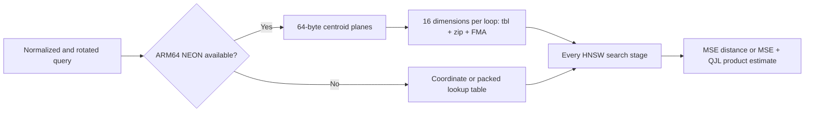

# TurboQuant Implementation and Benchmark Report

**Date:** 2026-07-31

**Toolchain:** `swift-6.4.x-DEVELOPMENT-SNAPSHOT-2026-07-23-a`

**Compiler commit:** `ef761e567dc94ee`

**Host:** Apple M4 Max, 14 CPU cores, 36 GB memory

**Workload:** deterministic synthetic unit vectors, cosine Recall@10, `M=16`,
`efConstruction=200`, seed `42`

## Outcome

The production `TurboQuantIndex` implements both TurboQuant objectives:

- MSE codes using Lloyd-Max scalar quantization and ADC.
- Product estimation using `(b - 1)` MSE bits, QJL residual signs, and the
  residual norm.
- Exact Haar rotations with finite-dimensional spherical Lloyd-Max centroids.
- Fast structured HD³ rotations with Gaussian-limit Lloyd-Max centroids.

The product estimator is used during every HNSW search stage: upper-layer
greedy descent, level-zero expansion, candidate retention, and final ordering.
It is not a detached reranker.

The ARM64 implementation now evaluates four-bit MSE codes with a NEON kernel
that reconstructs exact `Float32` centroids in registers. It removes the old
576 KiB retained lookup workspace in favor of 64 bytes of centroid byte
planes. At 768 dimensions and matched `0.414` Recall@10, MSE 4-bit reached
1.515 times the Float32 QPS using the median of within-cycle ratios in the
isolated, order-rotated rerun. It won two of three paired cycles.

Product 5-bit uses the same accelerated MSE component but remains at 0.955
times Float32 by the same paired method because its QJL residual estimator
adds work. TurboQuant MSE 4-bit has positive ARM64 NEON performance evidence,
but the cycle variance prevents treating this run as a stable capacity
guarantee. Product 5-bit is not yet a demonstrated latency optimization.

The follow-up commit `0b12406` optimizes the Product QJL path with two 16-entry
nibble rows per packed sign byte, four independent accumulators, and a
conservative absolute-sum bound that can skip QJL scoring after the MSE lower
bound is already worse than the retained HNSW bound. At 768 dimensions the
query table is reduced from 96 KiB to 12 KiB. The bound is accumulated in
`Double` and rounded upward before pruning, so the Float32 lookup reduction
cannot invalidate the lower-bound proof. The follow-up isolated run is
reported separately below; it is not a paired before/after speed claim.



## Measurement Method

The benchmark uses the same generated vectors, graph configuration, labels,
queries, and exact cosine ground truth for each representation. Each
representation runs in a separate process so another index cannot add shared
cache or memory-pressure interference. Process order rotates across three
cycles. Each search point is warmed up, then executes 50 queries five times
per process. Build timing includes `TurboQuantIndex.finalize()`.

The optimized rerun records one CPU-QPS summary per process and search point.
The frontier table uses the median of the three process summaries for each
representation. The primary relative-performance result first divides
TurboQuant QPS by Float32 QPS within each cycle, then takes the median of those
three paired ratios. Each process summary covers five measured batches of 50
queries after warmup. Process CPU time removes descheduling time but cannot
remove frequency or system-wide interference. The optimized rerun does not
retain per-query samples, so it makes no p95 latency claim.

Packed-code memory excludes HNSW topology, allocator metadata, and retained
query workspaces. Product memory lists its shared QJL projection separately.
The optimized process summaries and schedule are stored in
[`benchmark-artifacts/2026-07-31-d768-neon`](benchmark-artifacts/2026-07-31-d768-neon/README.md).
The complete pre-optimization raw logs remain in
[`benchmark-artifacts/2026-07-31-d768-isolated`](benchmark-artifacts/2026-07-31-d768-isolated/README.md).

## Post-change QJL verification (`0b12406`)

This clean-source Release run used the same deterministic d=768 workload and
the fixed Swift 6.4 development snapshot. It measured one isolated target per
process with five batches of 50 queries after warmup. Because no old-QJL target
was run in the same paired cycle, these values validate the current behavior
and recall only; they do not establish a causal speedup over the previous
implementation.

| `efSearch` | Product 5-bit recall | Product QPS | Product p95 ms/query | MSE 4-bit recall | MSE QPS | MSE p95 ms/query |
| ---: | ---: | ---: | ---: | ---: | ---: | ---: |
| 10 | 0.082 | 11,145 | 0.125 | 0.070 | 22,911 | 0.089 |
| 20 | 0.150 | 7,796 | 0.185 | 0.142 | 13,479 | 0.158 |
| 40 | 0.230 | 5,044 | 0.277 | 0.208 | 6,951 | 0.203 |
| 60 | 0.296 | 3,582 | 0.425 | 0.288 | 5,236 | 0.240 |
| 100 | 0.414 | 2,404 | 0.505 | 0.414 | 3,616 | 0.371 |
| 200 | 0.604 | 1,421 | 0.996 | 0.594 | 2,175 | 0.545 |
| 400 | 0.758 | 976 | 1.307 | 0.766 | 1,371 | 1.091 |

The exact logs record `source_revision=0b12406c36c8915de33dc2fcc2dcfd3e8c9483ec`
and `source_state=clean` in
[`benchmark-artifacts/2026-07-31-d768-qjl-nibble-pruning`](benchmark-artifacts/2026-07-31-d768-qjl-nibble-pruning/README.md).

## 10,000 Vectors, 768 Dimensions

### Recall/QPS frontier

| `efSearch` | Float32 recall | Float32 QPS | MSE 4-bit recall | MSE 4-bit QPS | Product 5-bit recall | Product 5-bit QPS |
| ---: | ---: | ---: | ---: | ---: | ---: | ---: |
| 10 | 0.068 | 13,113 | 0.070 | 21,939 | 0.082 | 5,654 |
| 20 | 0.122 | 7,037 | 0.142 | 12,151 | 0.150 | 4,536 |
| 40 | 0.216 | 3,900 | 0.208 | 7,732 | 0.230 | 3,369 |
| 60 | 0.274 | 2,757 | 0.288 | 3,856 | 0.296 | 2,411 |
| 100 | 0.414 | 1,873 | 0.414 | 3,327 | 0.414 | 1,789 |
| 200 | 0.624 | 1,081 | 0.594 | 2,114 | 0.604 | 963 |
| 400 | 0.828 | 674 | 0.766 | 1,279 | 0.758 | 686 |

Median build time across the three isolated processes was 7.12 seconds for
Float32 HNSW, 8.23 seconds for MSE 4-bit, and 10.53 seconds for Product 5-bit.
System load varied materially during the rerun, so build timing is reported
only as context and is not used to support the search-kernel conclusion.

At exactly 0.414 Recall@10:

| Representation | Median QPS | Ratio of independent medians | Packed code memory |
| --- | ---: | ---: | ---: |
| Float32 | 1,873 | 1.000x | 30.72 MB |
| TurboQuant MSE 4-bit | 3,327 | 1.776x | 5.12 MB |
| TurboQuant Product 5-bit | 1,789 | 0.955x | 6.12 MB + 2.36 MB shared projection |

Because independently aggregated medians are not paired comparisons, the
relative-performance conclusion uses the cycle ratios:

| Representation | Cycle 1 | Cycle 2 | Cycle 3 | Median paired ratio |
| --- | ---: | ---: | ---: | ---: |
| TurboQuant MSE 4-bit / Float32 | 1.515x | 2.144x | 0.708x | 1.515x |
| TurboQuant Product 5-bit / Float32 | 1.034x | 0.837x | 0.955x | 0.955x |

MSE uses one sixth of the Float32 vector-code memory and has a 51.5% faster
median paired result, with wins in two cycles and a loss in one. Product
retains its memory reduction but has a 4.5% slower median paired result. The
variance is material and requires more quiet-host cycles before using these
figures as a capacity forecast.

### Pre-optimization baseline

The earlier isolated implementation used scalar packed-byte lookup and
accumulation:

| Representation | Previous QPS | Previous relative to Float32 | Optimized QPS | Optimized relative to Float32 |
| --- | ---: | ---: | ---: | ---: |
| Float32 | 3,083 | 1.000x | 1,873 | 1.000x |
| TurboQuant MSE 4-bit | 1,340 | 0.435x | 3,327 | 1.776x |
| TurboQuant Product 5-bit | 1,066 | 0.346x | 1,789 | 0.955x |

The host was slower during the optimized rerun, as shown by the Float32
control. MSE and Product absolute QPS increased despite that load, but the two
runs are not paired and those historical changes are not used as the primary
speedup evidence.

## 50,000 Vectors, 768 Dimensions

The previous interleaved 50,000-vector rerun did not complete within the
120-second verification bound. No 50,000-vector result is presented as an
isolated-process measurement. The larger-cache-pressure hypothesis therefore
remains unverified at that scale.

## Why the MSE Path Is Faster

| Cost center | Float32 path | ARM64 MSE 4-bit path |
| --- | --- | --- |
| Candidate bytes at 768 dimensions | 3,072 bytes | 512 bytes after padding to 1,024 dimensions |
| Query-specific lookup state | None | 64-byte centroid planes |
| Candidate distance | Contiguous SIMD dot product | 16 coordinates per NEON loop |
| Decode | None | Four `tbl` lookups reconstruct exact `Float32` bits |
| Accumulation | SIMD FMA | Four independent SIMD FMA accumulators |
| Candidate order | Arbitrary graph neighbors | Same arbitrary graph neighbors |

The kernel reads eight packed bytes for sixteen coordinates, interleaves the
high and low nibbles in coordinate order, reconstructs four-byte centroids with
NEON table lookups and zip operations, then accumulates with four independent
FMA chains. Odd and non-multiple-of-sixteen dimensions use a scalar tail.

The non-NEON path remains functional and uses the coordinate/packed lookup
implementation. Capability selection is explicit; an unsupported platform
does not silently execute the ARM64 kernel. Product 5-bit still performs its
QJL projection and residual estimate. The new pruning path is active in
production search, but a separate pruning-count counter is intentionally not
part of the public API; follow-up paired cycles are required before claiming a
stable QJL latency improvement.

## Verification

| Verification | Result |
| --- | --- |
| Native package tests | 133 concrete test cases passed, 0 failed; 12 benchmark cases skipped |
| Address Sanitizer | 10 final-source quantizer, ARM64 kernel, and forced-fallback tests passed |
| Thread Sanitizer | 12 contract tests, including concurrent search, passed; no race reported |
| Undefined Behavior Sanitizer | 10 quantizer/kernel/fallback tests passed after explicitly linking the snapshot runtime |
| Regular WASM final-source build | Compile and link passed |
| Embedded WASM final-source build | Compile and link passed |
| Archive validation | Version, metadata, address ranges, retained graph/search budgets, padding, topology, residual bounds, and truncation failures tested |

The current snapshot cannot compile the package's existing `Float16` APIs for
an x86_64 macOS destination, so a Rosetta package-level run was unavailable.
The non-NEON production branch was instead forced through the internal
capability input; coordinate-table and packed-table searches over the same
finalized index produced the same labels and distances.

### Shared-state review matrix

| Logical state | Native storage/isolation | WASM storage/isolation | Embedded storage/isolation | Read/mutation entry | Release |
| --- | --- | --- | --- | --- | --- |
| `HNSWIndex.State` | `Mutex<State>` | `Mutex<State>` | `Mutex<State>` | `withLock` | Owner lifetime |
| `TurboQuantIndex.State` | `Mutex<State>` | `Mutex<State>` | `Mutex<State>` | `withLock` | `finalize()` releases the Float builder; owner lifetime releases packed state |
| Quantizer, rotation, and QJL parameters | Immutable `Sendable` values | Same | Same | Borrowed synchronous reads | Owner lifetime |

There is no `hasFeature(Embedded)` or `canImport(Synchronization)` branch in the
shared-state declarations. Query rotation, lookup construction, graph traversal,
and result materialization execute under the same state boundary on every target.

Thread Sanitizer reported no race, but its runtime emitted an `Invalid dyld module map`
warning and stated that backtraces might be unreliable. The concurrent behavior tests
completed successfully; the sanitizer warning remains a tooling limitation.

The fixed WASM SDK identifiers are:

- `swift-6.4.x-DEVELOPMENT-SNAPSHOT-2026-07-23-a_wasm`
- `swift-6.4.x-DEVELOPMENT-SNAPSHOT-2026-07-23-a_wasm-embedded`

Reproduce one isolated representation from the benchmark package:

```bash
TURBOQUANT_BENCHMARK_CASE=d768 \
TURBOQUANT_BENCHMARK_TARGET=turboquant-mse-4 \
TURBOQUANT_BENCHMARK_RUN_ID=local-d768-mse4 \
TURBOQUANT_PRIMARY_ONLY=1 \
TOOLCHAINS=org.swift.64202607231a \
swift run -c release \
  --package-path Benchmarks/HNSWReferenceComparison \
  TurboQuantComparison | tee /tmp/turboquant-d768-mse4.log
```

Use `hnsw-cosine`, `turboquant-mse-4`, and `turboquant-product-5` as target
values, and rotate their process order across repeated cycles.

Source: [TurboQuant: Online Vector Quantization with Near-optimal Distortion
Rate](https://arxiv.org/html/2504.19874).
